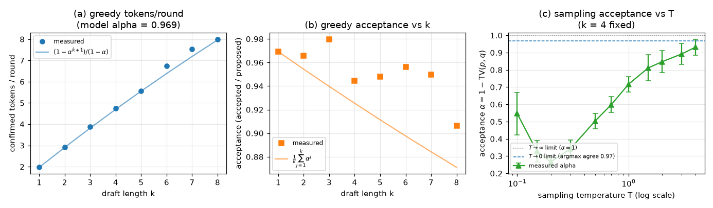

# Experiment 03: offline acceptance study on the toy backend

## Question

Two questions about the *model-level* behavior of speculative decoding, asked on
the fully offline toy backend so the whole study reproduces from a clean checkout
with no checkpoint download:

1. **Draft length.** Under greedy decoding, how do the acceptance estimate
   `accepted / proposed` and the confirmed tokens per round depend on the draft
   length `k`, and how closely does the measured tokens-per-round track the
   geometric model `(1 − α^(k+1)) / (1 − α)` derived in
   [`notes/derivation-acceptance-sampling.md`](../../notes/derivation-acceptance-sampling.md)?
2. **Temperature.** Under sampling, how does the acceptance rate α depend on the
   softmax temperature? The theory predicts α equals the distribution overlap
   `Σ min(p, q) = 1 − TV(p, q)`, which has two exact limits: as `T → 0` both
   distributions collapse onto their argmaxes and α → the greedy argmax-agreement
   rate, while as `T → ∞` both flatten toward uniform and α → 1. The question is
   what the curve does between the limits.

This complements [experiment 02](../02-draft-length-sweep/), which measures the
same draft-length quantities on real GPT-2. The contrast between the two is the
point of running both (see Findings).

## Setup

- **Backend:** toy (tiny randomly-initialized GPT-2 pair; no network).
- **Models:** 4-layer target and 2-layer draft, `n_embd = 128`, shared
  256-token vocabulary, seeds 1 (target) and 2 (draft) — the same construction
  the unit tests and `benchmark.py --backend toy` use.
- **Prompt:** a fixed 16-token random sequence (seed 0).
- **Decoding:** greedy for the draft-length sweep; sampling for the temperature
  sweep, with the project's `top_k = 0`, `top_p = 1.0` defaults.
- **Software:** Python 3.13, PyTorch 2.6.0, CPU. The greedy sweep is fully
  deterministic; the sampling sweep is seeded (generator seeds 1000–1007) and
  reproduces exactly for a given PyTorch version.
- **Entry point:** [`run.py`](run.py). Raw outputs are written to
  [`results/`](results/) (two CSVs and the figure below).

The greedy sweep covers `k ∈ {1, …, 8}`; the temperature sweep fixes `k = 4` and
averages each temperature over 8 generator seeds, reporting the standard
deviation across seeds. `α` is the harness definition `accepted / proposed`, with
`proposed = k` every round; the per-position α that drives the geometric
predictions is taken from the `k = 1` greedy row.

## Findings



### Greedy draft-length sweep

```
device=cpu backend=toy vocab=256 max_new_tokens=128
```

| k | α (acc/prop) | model α | tokens/round | model tokens/round | rounds | lossless |
|---|---|---|---|---|---|---|
| 1 | 0.969 | 0.969 | 1.969 | 1.969 | 65 | yes |
| 2 | 0.966 | 0.954 | 2.909 | 2.909 | 44 | yes |
| 3 | 0.980 | 0.940 | 3.879 | 3.819 | 33 | yes |
| 4 | 0.944 | 0.925 | 4.741 | 4.702 | 27 | yes |
| 5 | 0.948 | 0.911 | 5.565 | 5.557 | 23 | yes |
| 6 | 0.956 | 0.898 | 6.737 | 6.386 | 19 | yes |
| 7 | 0.950 | 0.884 | 7.529 | 7.189 | 17 | yes |
| 8 | 0.906 | 0.871 | 8.000 | 7.968 | 16 | yes |

`model α` is `(1/k) Σ_{j=1}^{k} α^j` and `model tokens/round` is
`(1 − α^(k+1)) / (1 − α)`, both evaluated at the constant per-position
`α = 0.969` from `k = 1`.

1. **Output stays bit-for-bit identical to greedy autoregressive decoding for
   every k** (the losslessness column is `yes` throughout), confirming the
   KV-cache cropping and verification rule are correct independent of `k`.
2. **Measured tokens per round closely track the geometric model** — panel (a).
   The largest gap over the sweep is 0.35 token (at `k = 6`), and the measured
   curve sits at or just above the constant-α line.
3. **Acceptance `accepted / proposed` stays high and roughly flat (~0.95), not
   declining** — panel (b). It even sits *above* the constant-α prediction,
   because the toy model's per-position greedy agreement shows no systematic
   depth trend (it fluctuates between 0.906 and 0.980 with no monotone fall). This
   is the sharp contrast with [experiment 02](../02-draft-length-sweep/), where
   the same quantity on real GPT-2 collapses from 0.902 (`k = 1`) to 0.562
   (`k = 8`): in real text, positions deeper into a round are conditionally
   harder, so per-position acceptance genuinely decays with depth, whereas the
   homogeneous random toy model has no such structure. The constant-α geometric
   model is therefore a near-exact description of the toy backend but only an
   upper-envelope idealization for real models.

The harness counts the final round only up to `max_new_tokens = 128`, which
slightly truncates `tokens/round` at large `k` (e.g. `k = 8` reports exactly
`128 / 16`); this accounts for the small residual gap in panel (a) at the largest
`k`.

### Sampling temperature sweep (k = 4, 8 seeds)

| temperature | α (mean) | α (std) | tokens/round | seeds |
|---|---|---|---|---|
| 0.10 | 0.546 | 0.123 | 3.145 | 8 |
| 0.15 | 0.329 | 0.063 | 2.279 | 8 |
| 0.20 | 0.266 | 0.031 | 2.052 | 8 |
| 0.30 | 0.342 | 0.050 | 2.343 | 8 |
| 0.50 | 0.503 | 0.045 | 2.986 | 8 |
| 0.70 | 0.599 | 0.046 | 3.347 | 8 |
| 1.00 | 0.717 | 0.045 | 3.787 | 8 |
| 1.50 | 0.811 | 0.076 | 4.199 | 8 |
| 2.00 | 0.847 | 0.063 | 4.356 | 8 |
| 3.00 | 0.892 | 0.061 | 4.488 | 8 |
| 4.00 | 0.932 | 0.046 | 4.621 | 8 |

4. **Acceptance is U-shaped in temperature, bracketed by two analytic limits** —
   panel (c). It bottoms out at α = 0.266 near `T = 0.2`, rises back to 0.546 as
   `T → 0.1` (heading for the `T → 0` limit, the greedy argmax-agreement rate
   ≈ 0.969 marked by the dashed line), and rises to 0.932 by `T = 4.0` (heading for
   the `T → ∞` limit α = 1, the dotted line). Both tails are exactly the behavior
   `α = 1 − TV(p, q)` predicts: at very low temperature the draft and target each
   concentrate on a single token and agree whenever their argmaxes agree (≈ 97% of
   positions here); at very high temperature both approach the uniform
   distribution, so their total-variation distance vanishes and every token is
   accepted. The minimum in between is where the temperature-scaled distributions
   are most dissimilar — sharp enough to put most mass on a few tokens, but not so
   sharp that they have both collapsed onto the same argmax.
5. **Confirmed tokens per round track the same U-shape** (2.05 at `T = 0.2` up to
   4.62 at `T = 4.0`), because tokens per round is a monotone function of α at
   fixed `k`. Throughout, the emitted tokens remain exactly target-distributed
   (Section 1 of the derivation note): temperature trades output diversity against
   acceptance — and hence against how many tokens the draft supplies for free
   (Section 2) — without ever biasing the output distribution.

## Reproduce

```bash
# from the repository root with the .venv active
python experiments/03-toy-acceptance-sweep/run.py            # tables + figure
python experiments/03-toy-acceptance-sweep/run.py --no-plot  # tables only (no matplotlib)
```

The toy models are built locally with fixed seeds, so no network access or
checkpoint cache is needed and the printed tables reproduce exactly. The figure
requires `matplotlib` (`pip install matplotlib`); the measurement path itself
uses only the pinned project requirements.

## Next

- Repeat the temperature sweep on real GPT-2 (experiment 02's pairing) to check
  whether the same U-shaped `α`-vs-`T` relationship holds when `p` and `q` carry
  real linguistic structure rather than random weights, and where the minimum
  falls.
- Add per-position acceptance (α at each draft index within a round) to localize
  where real models lose acceptance with depth, the effect that separates the toy
  and GPT-2 curves in panel (b).
